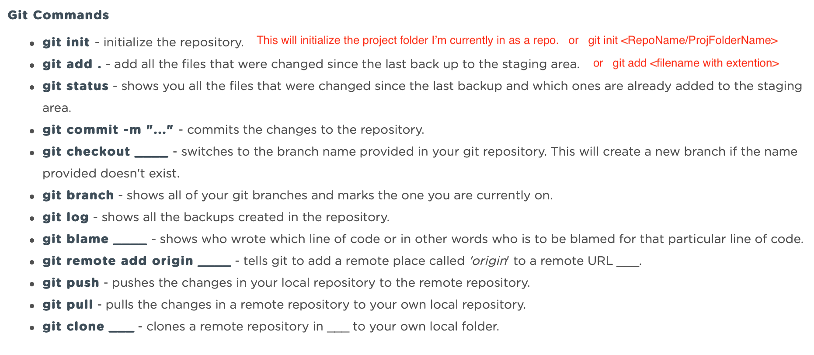
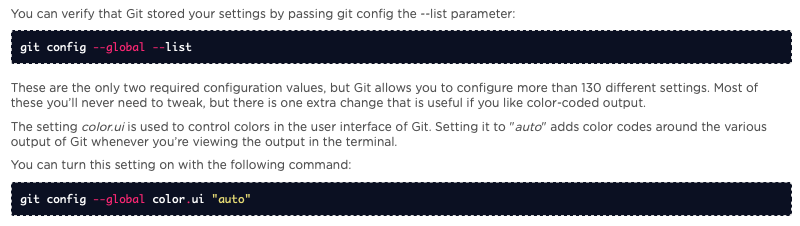

## Purpose: Remind myself of the Useful Git Commands

&nbsp;
&nbsp;

### Git Commands
| Commands | Meaning | Resources |
| :--- | :--- | :---: |
| `git init`  | initialize a local git repository | 
| `git add .` | add all the files that were changed since the last back up or commit to the staging area |  |
| `git add <fileNameWith.extension>` | add the specified file to staging *before* running `git commit` |  |
| `git commit -m "..." ` | commits the changes to the local git repository |  |
| `git commit -a -m "..." ` | add file and commit in single command *when there is not any new file* |  |
| `git remote add origin https://---.git` | tells git to add a remote repo (origin: GitHub or GitLab or BitBucket) with the provided URL location    `git remote add origin https://github.com/<gitub_Username>/<github_Repo_Name>.git`  `git remote add origin https://github.com/geeeedev/sandbox-react.git` |  |
| `git reset /path/filename.ext` | undo a git-add *before commit*   Best for: accidentally added a (one) wrong file or in a wrong repo | |
| `git reset` | undo whole uncommitted branch back to before git add - undo everything added | |
| | | |
| `git push` | push the changes to the remote repository from your local repository   `git push origin` &nbsp;&nbsp;&nbsp;//origin = GitHub repo    `git push origin master` &nbsp;&nbsp;&nbsp;//master = local repo |  |
| `git push --all ` | push all branches to remote repository   `git push --all origin`  |  |
| `git pull` | pull the changes from the connected remote repository to your current local directory |  |
| `git status` | shows all the files that were changed since the last backup and which ones are already added to the staging area |  |
| `git status <branchName>` | shows all the files that were changed since the last backup and which ones are already added to the staging area |  |
| | | |
| `git checkout -b <branchName> <optionalFromBranch>` | switches to the branch name provided in local git repository.   will create a new branch *and* switch to it if the branch name provided does not exist.   this replaces below git branch and git switch two steps| [learn more](https://www.atlassian.com/git/tutorials/using-branches) |
| `git branch <branchName>` | creates a new branch using branch name only - does *not* switch over to the newly created branch | [learn more](https://www.atlassian.com/git/tutorials/using-branches) |
| `git checkout <branchName>` | switches over to the provided branch name | [learn more](https://www.atlassian.com/git/tutorials/using-branches) |
| `git checkout -` | quick switches between last two working branches | [learn more](https://medium.com/@gitship/15-git-hacks-to-save-your-life-as-a-developer-aa8808846dbb) |
| `git branch` | shows all of your git branches and marks the one you are currently on in green | [learn more](https://www.atlassian.com/git/tutorials/using-branches) |
| `git merge <branchName>` | merges provided branch name to existing (main) branch - be sure to `checkout` and switch over to the main branch first  | [learn more](https://www.atlassian.com/git/tutorials/using-branches) |
| `git diff` | view all merge conflicts (when conflict occurs after git merge)   type 'q' or 'z' to exit log   type 'h' to seek help |  |
| `git diff --base` | view merge conflicts against the base file |  |
| `git branch -d <branchName>` | deletes the provided branch name *with safe operation* to prevent deletion when unmerged changes exist |  |
| `git branch -D <branchName>` | *FORCE* deletes the provided branch name regardless of unmerged changes existence  |  |
| | | |
| `git stash` | temporarily stash away all local changes to yield a clean working copy   Best for: have some local changes not ready to be committed, but need to start working on something else completely different, like an urgent bug fixes |  |
| `git stash list` | shows all git stash items   Stash uses Stack: first/oldest is named `stash@{0}` and increments up `stash@{1}`, `stash@{2}`, etc.   However, this number is *not* the same as its stash index |  |
| `git stash pop` | restore and apply the newest/latest Stash and *clear* it from Stash storage    `stash@{0}`...   (Stack/LIFO)   `stash@{1}`...   `stash@{2}`...   `stash@{3}`... <<< `git stash pop` and removes this one first    Stash is not bound to the branch which creates it: when restoring, the changes will be applied to current HEAD branch, whichever this may be. So be sure current working environment is ready for the overlay |  |
| `git stash apply stash@{index}` | restore and apply the specified Stash but it will remain saved on the Stash list   Stash uses the Stack/LIFO structure - latest stash as index 0 and oldest stash as index 3 (if there were 4 stashes total)   `git stash apply stash@{0}` - INDEX 0 for the latest/newest version   `git stash apply stash@{3}` - INDEX \<last\> for the oldest/first version (the stash@{0} label)|  |
| `git stash drop stash@{index}` | remove and clear the specified Stash from Stash list   Stash uses the Stack/LIFO structure - latest stash as index 0 and oldest stash as index 3 (if there were 4 stashes total)   same as `apply`   `git stash drop stash@{0}` - dropping the latest/newest version   `git stash drop stash@{3}` - dropping the earliest version - all stash labels move up |  |
| `git stash clear` | remove all stash versions on Stash list |  |
| `git restore <path/path/filename.ext>`| discard all changes in working directory revert back to before any changes   works well with `git stash apply <>` | |
| | | |
| `git log` | shows all the backups created in the repository   type 'q' to exit log |  |
| `git log -p` | see only the diff introduced in each commit   type 'q' to exit log |  |
| `git clone <url>` | clones a remote repository from the provided URL to your current local folder directory   `git clone https://github.com/geeeedev/chittychat.git` |  |
| `git fetch` | ... ... ... ??? ??? |  |
| `git tag`   | ... ... ... ??? ??? |  |
| | | |
| `git remote remove <remoteRepoName>` | delete remote repo you added |  |
| `git remote` | list all remote repos you are connected to |  |
| `git remote show <remoteRepoName>` | see more info about a remote repo   `git remote show origin` |  |
| `git remote get-url origin` | list the URL address of the remote repo (origin) |  |
| `git blame <filePath/filePath/fileName.ext>` | shows who wrote which line of code with timestamp, in other words who is to be blamed for that particular line of code |  |
| | | |  

&nbsp;
&nbsp;

### Git Config
| Commands | Meaning |
| :--- | :--- |
| `git config --global user.name "..."` | set username |
| `git config --global user.email xxxxxx@xxxx.xxx` | set email |
| `git config --global --list` | list and verify settings |
| `git config --global color.ui "auto"` | turn on color codes in Git output in Terminal |
| | | |

  

> [See more helpful shortcuts](https://medium.com/@gitship/15-git-hacks-to-save-your-life-as-a-developer-aa8808846dbb)

