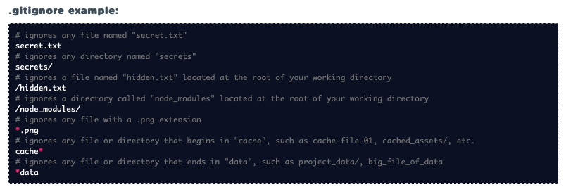

## Purpose: Remind myself how to get started with Git and GitHub

### Git Commands

- git init - initialize the repository.
- git add . - add all the files that were changed since the last back up to the staging area
- git add `filename with extension`  - add the specified file to staging
- git status - shows you all the files that were changed since the last backup and which ones are already added to the staging area.
- git commit -m "..." - commits the changes to the repository.
- git checkout ____ - switches to the branch name provided in your git repository. This will create a new branch if the name provided doesn't exist.
- git branch - shows all of your git branches and marks the one you are currently on.
- git log - shows all the backups created in the repository.
- git blame ____ - shows who wrote which line of code or in other words who is to be blamed for that particular line of code.
- git remote add origin ____ - tells git to add a remote repo with the URL ___.
   ```
   git remote add origin https://github.com/<gitub username>/<github repo name>.git
   git remote add origin https://github.com/geeeedev/sandbox-react.git
   ```
- git push - push the changes to the remote repository from your local repository .
   ```js
   git push origin master  //origin = GitHub repository; master = our local repository
   ```
- git pull - pull the changes from a remote repository to your current local directory.
- git clone ___ - clones a remote repository in ___ to your current local folder.
   ```
   git clone https://github.com/geeeedev/chittychat.git
   ```
- git remote remove {remote repo name} - delete remote repo you added
- git remote - list all remote repos you are connected to
- git remote show {remote repo name} - see more info about a remote repo


### Git Ignore
- ignores any file named "secret.txt"  
   secret.txt
- ignores any directory named "secrets"  
   secrets/
- ignores a file named "hidden.txt" located at the root of your working directory  
   /hidden.txt
- ignores a directory called "node_modules" located at the root of your working directory  
   /node_modules/
- ignores any file with a .png extension  
   *.png
- ignores any file or directory that begins in "cache", such as cache-file-01, cached_assets/, etc.  
   cache*
- ignores any file or directory that ends in "data", such as project_data/, big_file_of_data  
   *data




### Git Config
- git config --global user.name "..." - set username
- git config --global user.email xxxxxx@xxxx.xxx - set email
- git config --global --list - verify settings
- git config --global color.ui "auto" - turn on color codes in Git output in Terminal

